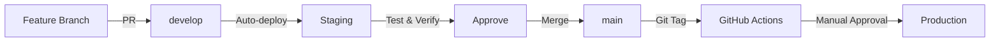

# Deployment Strategy - Villas Boats

## Overview

Villas Boats uses a **three-tier deployment strategy** with automated staging deployments and controlled production releases using semantic versioning.

```
┌─────────────┐     ┌─────────────┐     ┌──────────────┐
│   Local     │────▶│   Staging   │────▶│  Production  │
│ Development │     │  (develop)  │     │   (v1.x.x)   │
└─────────────┘     └─────────────┘     └──────────────┘
    Manual           Auto-deploy          Manual approval
   Testing          on push              on git tag
```

## Environments

### 1. Local Development
- **Purpose**: Individual developer testing
- **Trigger**: Manual (`docker compose -f docker-compose.local.yml up`)
- **Image Tags**: `develop` or `latest`
- **Database**: Separate local volumes
- **URL**: http://localhost:3000
- **Documentation**: [DEPLOYMENT.md - Local Development Testing](../DEPLOYMENT.md#local-development-testing)

### 2. Staging
- **Purpose**: Integration testing and QA
- **Trigger**: Automatic on push to `develop` branch
- **Image Tags**: `develop`, `develop-{sha}`
- **Database**: `villas-boats-postgres-staging`
- **URL**: https://villasboats.mcg.sh
- **Deployment**: Portainer webhook auto-deployment
- **Documentation**: [DEPLOYMENT.md](../DEPLOYMENT.md)

### 3. Production
- **Purpose**: Live user-facing application
- **Trigger**: Manual on git tag `v*.*.*`
- **Image Tags**: `v1.0.0`, `1.0.0`, `1.0`, `1`, `latest`
- **Database**: `villas-boats-postgres-production`
- **URL**: https://villasboats.com
- **Deployment**: Portainer with manual approval
- **Documentation**: [production-deployment.md](./production-deployment.md)

## Versioning Strategy

### Semantic Versioning 2.0.0

Format: **vMAJOR.MINOR.PATCH** (e.g., v1.2.3)

- **MAJOR** (v2.0.0): Breaking changes, incompatible API changes
- **MINOR** (v1.1.0): New features, backward-compatible functionality
- **PATCH** (v1.0.1): Bug fixes, backward-compatible fixes

**Examples**:
```bash
v1.0.0  # First production release
v1.0.1  # Bug fix release
v1.1.0  # New booking feature added
v2.0.0  # Breaking API changes
```

### Docker Image Tagging

**Staging** (develop branch):
```
ghcr.io/elogioseancoras-gif/villas-boats/backend:develop
ghcr.io/elogioseancoras-gif/villas-boats/backend:develop-abc123
```

**Production** (git tags):
```
ghcr.io/elogioseancoras-gif/villas-boats/backend:v1.0.0    # Exact version
ghcr.io/elogioseancoras-gif/villas-boats/backend:1.0.0     # Without 'v'
ghcr.io/elogioseancoras-gif/villas-boats/backend:1.0       # Minor version
ghcr.io/elogioseancoras-gif/villas-boats/backend:1         # Major version
ghcr.io/elogioseancoras-gif/villas-boats/backend:latest    # Latest stable
```

## Release Process

### Development Flow



### Step-by-Step Release

1. **Development & Testing**
   ```bash
   # Create feature branch
   git checkout -b feature/new-booking-flow

   # Develop and test locally
   docker compose -f docker-compose.local.yml up

   # Push and create PR to develop
   git push origin feature/new-booking-flow
   ```

2. **Staging Deployment** (Automatic)
   ```bash
   # Merge PR to develop
   git checkout develop
   git merge feature/new-booking-flow
   git push origin develop

   # GitHub Actions automatically:
   # 1. Builds images with 'develop' tag
   # 2. Pushes to GHCR
   # 3. Triggers Portainer webhook
   # 4. Staging deploys automatically
   ```

3. **Staging Verification**
   - Test at https://villasboats.mcg.sh
   - Run E2E tests
   - QA validation
   - Performance testing

4. **Production Release**
   ```bash
   # Merge develop to main
   git checkout main
   git pull origin main
   git merge develop
   git push origin main

   # Create release tag
   git tag -a v1.0.0 -m "Release v1.0.0: New booking system

   Features:
   - Advanced booking calendar
   - Multi-boat selection
   - Payment integration

   Fixes:
   - Login timeout issue
   - Mobile responsive layout"

   # Push tag (triggers production workflow)
   git push origin v1.0.0
   ```

5. **Manual Approval** (GitHub Actions)
   - GitHub Actions builds production images
   - Wait for manual approval in GitHub UI
   - Approve deployment to production environment

6. **Production Deployment**
   - Portainer webhook triggered (when configured)
   - Health checks verify deployment
   - Monitor application logs

7. **Post-Deployment**
   - Verify https://villasboats.com
   - Update CHANGELOG.md
   - Monitor error rates
   - Notify team

## Rollback Procedures

See [rollback-procedures.md](./rollback-procedures.md) for detailed rollback steps.

### Quick Rollback

```bash
# Option 1: Redeploy previous version (recommended)
# In GitHub Actions → deploy-production workflow
# Click "Run workflow" → Enter previous version (e.g., v1.0.0)

# Option 2: Create new tag pointing to old commit
git checkout <previous-commit-sha>
git tag -a v1.0.2 -m "Rollback to stable version"
git push origin v1.0.2
```

## Version Management

### When to Increment Versions

**PATCH (v1.0.X)**:
- Bug fixes
- Security patches
- Performance improvements (no API changes)
- Documentation updates

**MINOR (v1.X.0)**:
- New features (backward-compatible)
- New API endpoints
- UI enhancements
- Database schema additions (non-breaking)

**MAJOR (vX.0.0)**:
- Breaking API changes
- Database schema breaking changes
- Major architecture changes
- Removal of deprecated features

### Pre-release Versions

For beta testing:
```bash
v1.0.0-beta.1
v1.0.0-rc.1  # Release candidate
```

## CI/CD Workflows

### Staging Workflow
- **File**: `.github/workflows/deploy-staging.yml`
- **Trigger**: Push to `develop`
- **Tags**: `develop`, `develop-{sha}`
- **Approval**: None (automatic)

### Production Workflow
- **File**: `.github/workflows/deploy-production.yml`
- **Trigger**: Git tags `v*.*.*`
- **Tags**: `v1.0.0`, `1.0.0`, `1.0`, `1`, `latest`
- **Approval**: Manual (GitHub Environments)

## Environment Variables

### Staging
```bash
VERSION=develop
DOCKER_REGISTRY=ghcr.io
DOCKER_REPO=elogioseancoras-gif/villas-boats
```

### Production
```bash
VERSION=v1.0.0  # or 'latest' for always latest stable
DOCKER_REGISTRY=ghcr.io
DOCKER_REPO=elogioseancoras-gif/villas-boats
```

## Best Practices

### Git Workflow
1. ✅ Always create feature branches from `develop`
2. ✅ Test in staging before production
3. ✅ Use meaningful commit messages
4. ✅ Create annotated tags (`git tag -a`) with release notes
5. ✅ Never commit directly to `main`

### Release Workflow
1. ✅ Update CHANGELOG.md before tagging
2. ✅ Test thoroughly in staging
3. ✅ Create git tag with descriptive message
4. ✅ Wait for manual approval before production
5. ✅ Monitor production after deployment

### Version Tags
1. ✅ Use `v` prefix for git tags (v1.0.0)
2. ✅ Use annotated tags with release notes
3. ✅ Never delete or move production tags
4. ✅ Keep tags immutable (no force push)

## Monitoring & Health Checks

### Health Endpoints

**Staging**:
- Backend: https://villasboats.mcg.sh/api/actuator/health
- Frontend: https://villasboats.mcg.sh

**Production**:
- Backend: https://api.villasboats.com/actuator/health
- Frontend: https://villasboats.com

### Deployment Verification

After deployment, verify:
```bash
# Backend health
curl https://villasboats.com/api/actuator/health

# Frontend accessibility
curl -I https://villasboats.com

# Version verification
curl https://villasboats.com/api/actuator/info
```

## Troubleshooting

### Common Issues

**Issue: Wrong image version deployed**
```bash
# Check Portainer environment variables
# Verify VERSION=v1.0.0 (not 'develop')
```

**Issue: Production deployment failed**
```bash
# Check GitHub Actions logs
# Verify Portainer webhook configured
# Check Portainer stack status
```

**Issue: Health check failures**
```bash
# Check container logs
docker logs villas-boats-backend-production
docker logs villas-boats-frontend-production

# Check database connectivity
docker exec villas-boats-backend-production env | grep DB_
```

## References

- [Semantic Versioning 2.0.0](https://semver.org/)
- [Conventional Commits](https://www.conventionalcommits.org/)
- [Keep a Changelog](https://keepachangelog.com/)
- [Production Deployment Guide](./production-deployment.md)
- [Rollback Procedures](./rollback-procedures.md)
- [Developer Workflow](./developer-workflow.md)
